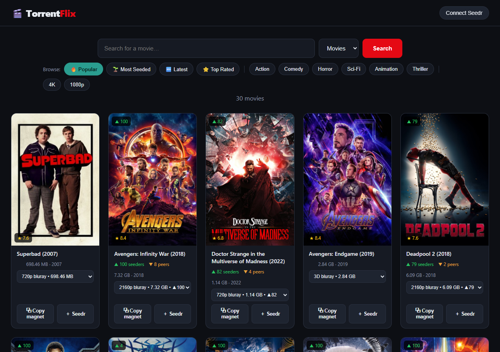
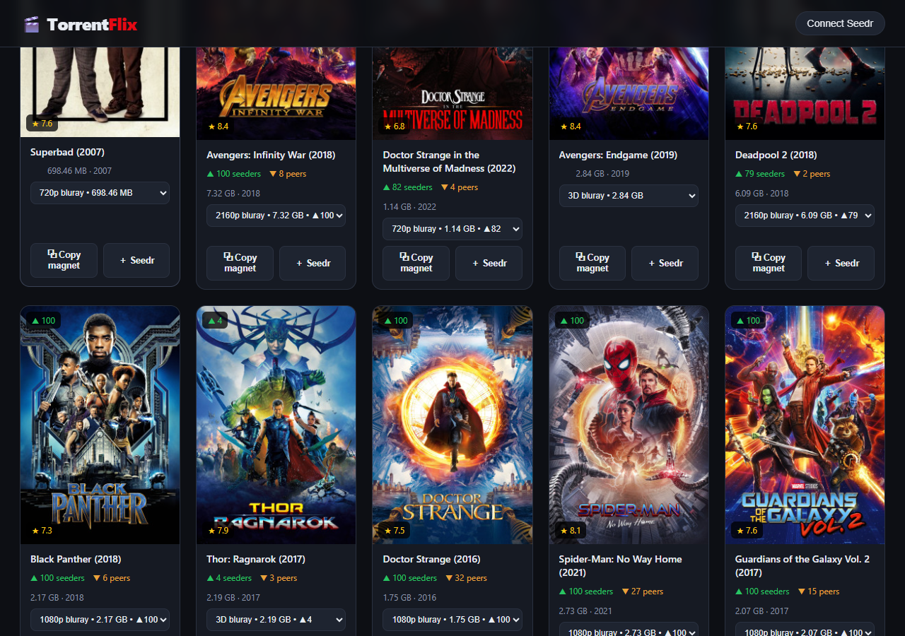
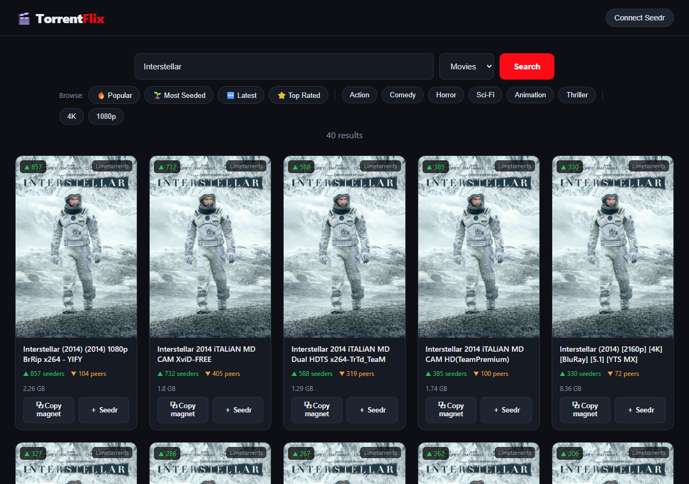

# 🎬 TorrentFlix — Torrent Movie Search


[](https://hub.docker.com/r/siyamexcom/torrent-movies)


A small, self-hostable web app that searches torrent sites, shows movies as
poster cards with seeder counts, lets you **copy a magnet with one click**, and
**push a magnet straight to your [Seedr.cc](https://www.seedr.cc) cloud** with
one button. Runs great on a Raspberry Pi / Orange Pi (CasaOS) via Docker.

Built on [`torrent-search-api`](https://github.com/JimmyLaurent/torrent-search-api)
(backend scraping), the keyless YTS & iTunes APIs, optional TMDB for posters,
and the Seedr OAuth API.



<p align="center">
  
  
</p>

## Features

- 🔎 Search across multiple public torrent providers (YTS, 1337x, TPB, LimeTorrents, EZTV)
- 🏷️ **Browse tags** — 🔥 Popular, 🌱 Most Seeded, 🆕 Latest, ⭐ Top Rated, genre chips (Action, Comedy, Horror, Sci-Fi…) and 4K / 1080p quality filters, powered by the keyless YTS API
- 🖼️ Movie poster art — **TMDB** if a key is set, otherwise a keyless **iTunes** fallback so photos still appear with zero config
- 🔍 **Click any poster to enlarge** it in a lightbox
- 🎚️ **Quality selector** on browse cards (720p / 1080p / 2160p) with per-quality seeders
- ▲ Seeder / ▼ peer counts and file size on every card, sorted by seeders
- ⧉ **Copy magnet** to clipboard with one click
- ＋ **Add to Seedr** — one click sends the magnet to your Seedr account

### About "Most Seeded"

The YTS API reports live seeders inconsistently in its bulk list, so the **Most
Seeded** tag pulls the popular pool and re-sorts by the seeders YTS *does*
report, defaulting each card to its best-seeded quality. For guaranteed-live
seeder numbers, use the search bar — that path scrapes the sites directly.

## Setup

```bash
npm install
cp .env.example .env      # then edit .env (PowerShell: copy .env.example .env)
npm start
```

Open <http://localhost:3000>.

### Posters (optional but recommended)

Posters need a free TMDB API key. Without it the app still works — cards just
show a 🎞️ placeholder.

1. Create an account at <https://www.themoviedb.org/>
2. Go to **Settings → API**, request a key
3. Put the **API Key (v3 auth)** value into `.env` as `TMDB_API_KEY=...`
4. Restart `npm start`

### Seedr

Click **Connect Seedr** in the top-right and enter your Seedr email + password.
Credentials are forwarded once to Seedr to obtain an access token; the token is
kept in your browser's localStorage and the server stores nothing. Then the
**＋ Seedr** button on any movie card sends that magnet to your account.

## 🐳 Run from Docker Hub

A prebuilt multi-arch image (amd64 + arm64) is published to
[`siyamexcom/torrent-movies`](https://hub.docker.com/r/siyamexcom/torrent-movies)
by GitHub Actions on every push to `main`. No build needed:

```bash
docker run -d --name torrentflix -p 3000:3000 \
  -e TMDB_API_KEY=your_key_optional \
  siyamexcom/torrent-movies:latest
```

…or with Compose:

```bash
docker compose -f docker-compose.hub.yml up -d
```

Then open `http://localhost:3000` (or `http://<device-ip>:3000`).

## 🍊 Deploy on Orange Pi / Raspberry Pi (CasaOS) with Docker

CasaOS is built on Docker, so the cleanest way to self-host is a container.
You can pull the prebuilt image above, or build it **on the device itself**
(native ARM) — just never copy a host `node_modules` into the image.

```bash
# 1. Copy the project to the device (or git clone it), then SSH in:
cd ~/Torrent-Movie-Search

# 2. (optional) add a TMDB key for nicer posters
cp .env.example .env && nano .env

# 3. Build & run — CasaOS already ships Docker
docker compose up -d --build

# 4. Watch the logs
docker compose logs -f
```

Open `http://<device-ip>:3000`. The container also appears in the CasaOS
dashboard automatically; for a managed tile use **CasaOS → + → Install a
customized app** with image `torrentflix:latest`, port `3000`, and the optional
`TMDB_API_KEY` env var.

> **Tip:** YTS's main domain is DNS-blocked by some ISPs. The app already tries
> mirrors (`yts.mx → yts.am → yts.lt → yts.rs`); override with `YTS_HOSTS` in
> `.env` if needed.

## How it works

| Piece | Where | Notes |
|-------|-------|-------|
| Torrent search | `server.js` → `/api/search` | Scraping must run server-side; results cached in memory so magnets can be resolved lazily |
| Browse tags | `/api/browse` | Calls the keyless YTS API (with mirror fallback); returns posters, ratings, per-quality torrents with magnets built from the hash |
| Magnet resolve | `/api/magnet/:id` | Search results: some providers include the magnet inline, others are fetched on demand via `getMagnet()`. Browse cards carry the magnet inline. |
| Posters | `fetchPoster()` | Cleans the release title, tries TMDB then iTunes, caches results |
| Seedr login | `/api/seedr/login` | `POST token.php` with `client_id=seedr_chrome` |
| Seedr add | `/api/seedr/add` | `POST resource.php` with `func=add_torrent` |

## Notes & caveats

- `torrent-search-api` scrapes public sites; individual providers break upstream
  from time to time. If one returns nothing, others still work.
- This is for **personal/educational use**. Only download content you are
  legally entitled to.
